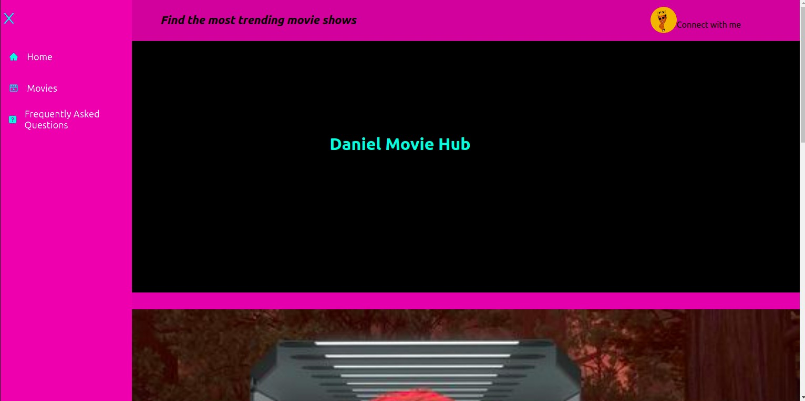
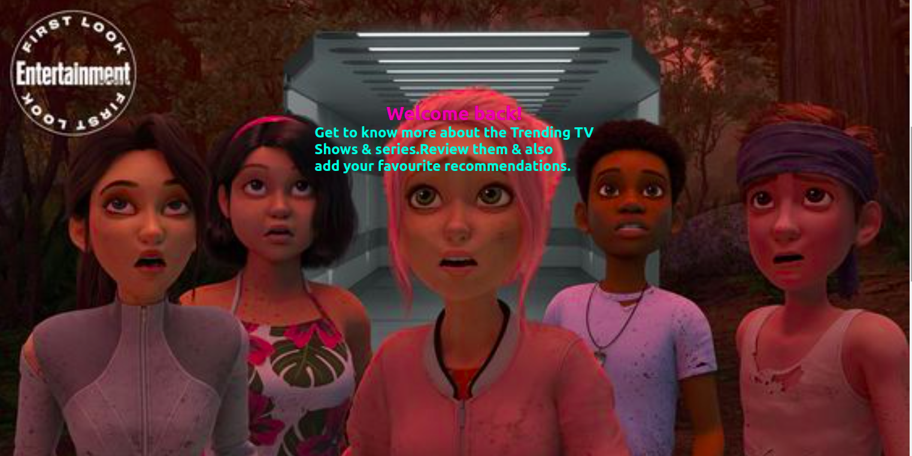
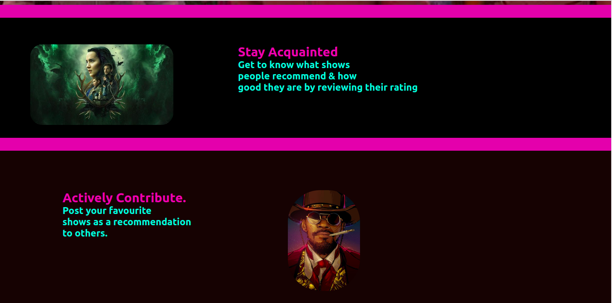
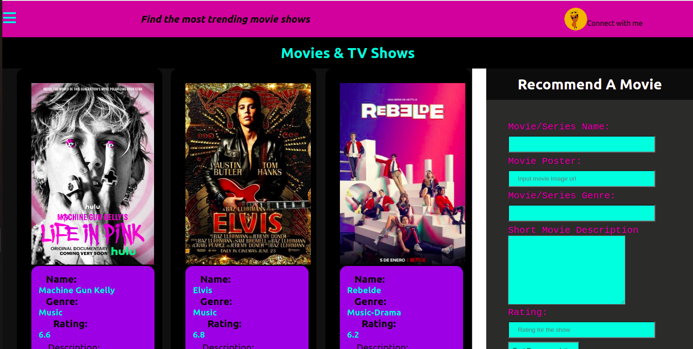
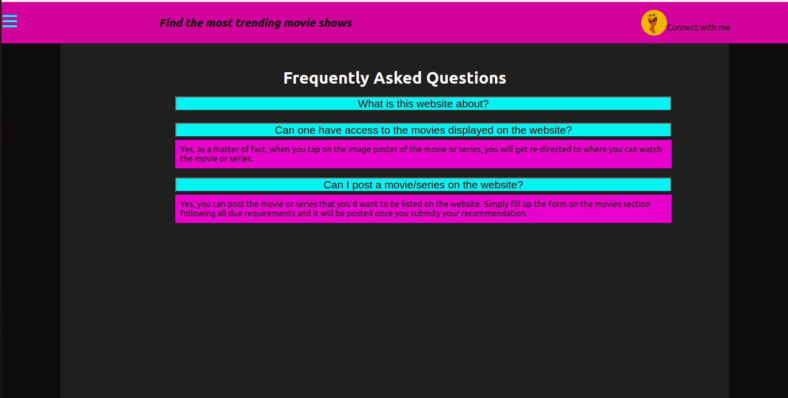

# Daniel Movie Hub

Daniel Movie Hub is movie website that allows users to know the trending TV shows depending on their ratings and other users' recommendations. As a user you can post a recommendation for others to watch by giving a description of the movie.

### By Daniel Obare Okebiro, 31/07/2022

## Landing Page

## Movies Page

## Frequently Asked Questions Page

## Live Demo on

[Youtube Video](https://youtu.be/pjMLm8xdYA0)

## Table of Content

- [Daniel Movie Hub](#DanielMovieHub)
  - [Daniel Obare Okebiro, 31/07/2022](#by-daniel-obare-31072022)
  - [Landing Page](#landing-page)
  - [Movie Page](#movie-page)
  - [Frequently Asked Questions Page](#frequently-asked-questions-page)
 
  - [Table of Content](#table-of-content)
  - [Description](#description)
  - [Features](#features)
    - [Requirements](#requirements)
    - [Installation Process](#installation-process)
    - [Live Link](#live-link)
    - [Technology Used](#technology--used)
  - [Known Bugs](#known-bugs)
  - [Licence](#licence)
  - [Author's Details](#authors-details)

## Description

---

Daniel Movie Hub allows movie enthusiasts land into the website, view a list  of trending movie shows and also recommend one for others, or whichever number they may wish to post.

---

[Go Back to the top](#DanielMovieHub)

## Features

As a user you should be able to:

1. `View` trending movie shows
2. `Upload` a recommendation of a movie for others

[Go Back to the top](#DanielMovieHub)

### Requirements

- Access to a computer, mobile phone or any other garget
- Internet access

### Installation Process

---

- Clone to this repo by running the command : `git@github.com:Thecodingobare/movies-and-series-hub.git`
- Unzip the downloaded files in a folder of choice.
- Open the folder with your favorite CLI tool.
- Run `npm install` on your terminal from inside the root folder of the project
- Run `node server.js` on your terminal from inside the root folder of the project to run the server
- The server should run on `http://localhost:3000` by default
- If the port is busy, kindly feel free to change the port inside the server.js file
- Once the server is up and running, visit the link `http://localhost:3000` to access the application
- Note that if you changed the port number, you will have a different port number on the link
- At this point, you will see the home page
- Manouvre through the website through the navigation bar on your left.

  ***

  [Go Back to the top](#DanielMovieHub)

### Technology Used

- HTML -to develop the structure of the page

- CSS - to style the User Interface
- NodeJS - To build a RESTful API
- ReactJS - Building component based UI

[Go Back to the top](#DanielMovieHub)

---

## Known Bugs

- When the website first loads, it only shows a white blank page with the top Navbar, so one has to click on the sidebar for the landing Page to load.

---

## Licence

MIT License
Copyright (c) [2022] [Daniel Obare Okebiro]
Permission is hereby granted, free of charge, to any person obtaining a copy
of this software and associated documentation files (the "Software"), to deal
in the Software without restriction, including without limitation the rights
to use, copy, modify, merge, publish, distribute, sublicense, and/or sell
copies of the Software, and to permit persons to whom the Software is
furnished to do so, subject to the following conditions:
The above copyright notice and this permission notice shall be included in all
copies or substantial portions of the Software.
THE SOFTWARE IS PROVIDED "AS IS", WITHOUT WARRANTY OF ANY KIND, EXPRESS OR
IMPLIED, INCLUDING BUT NOT LIMITED TO THE WARRANTIES OF MERCHANTABILITY,
FITNESS FOR A PARTICULAR PURPOSE AND NONINFRINGEMENT. IN NO EVENT SHALL THE
AUTHORS OR COPYRIGHT HOLDERS BE LIABLE FOR ANY CLAIM, DAMAGES OR OTHER
LIABILITY, WHETHER IN AN ACTION OF CONTRACT, TORT OR OTHERWISE, ARISING FROM,
OUT OF OR IN CONNECTION WITH THE SOFTWARE OR THE USE OR OTHER DEALINGS IN THE
SOFTWARE.

[Go Back to the top](#DanielMovieHub)

---

